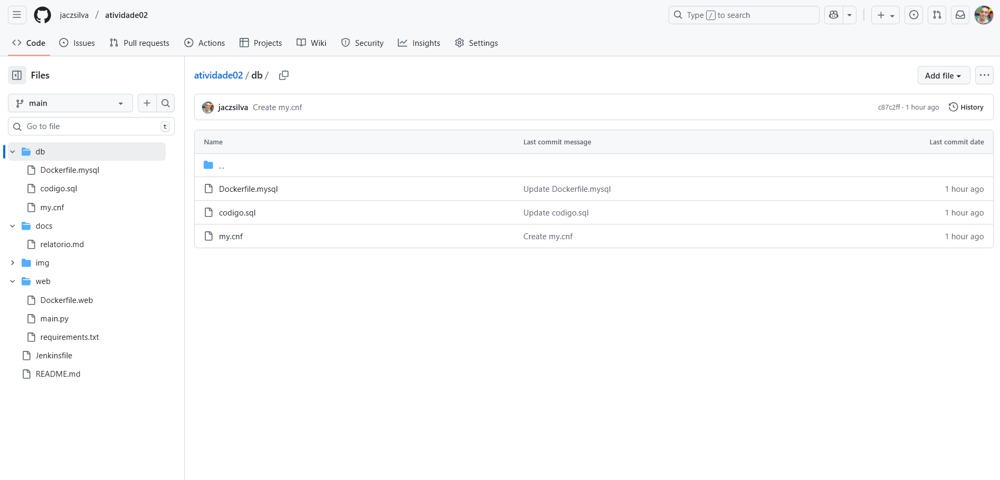
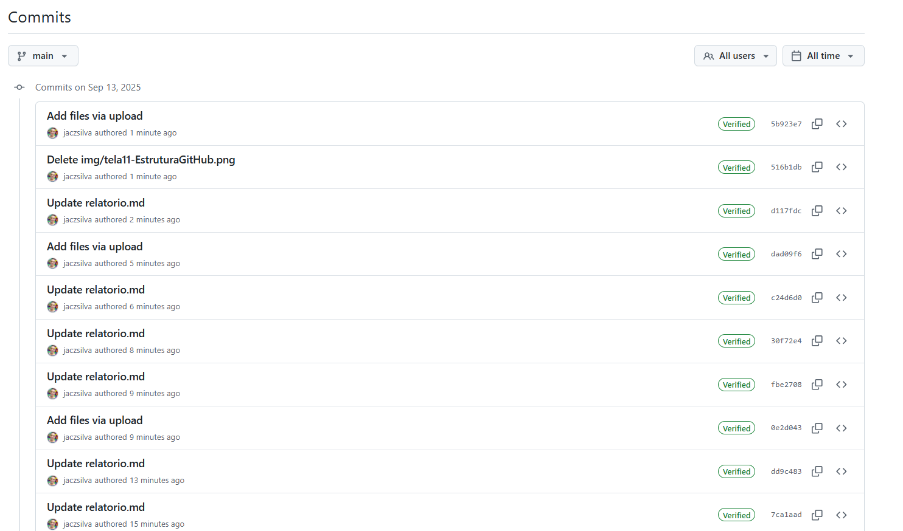
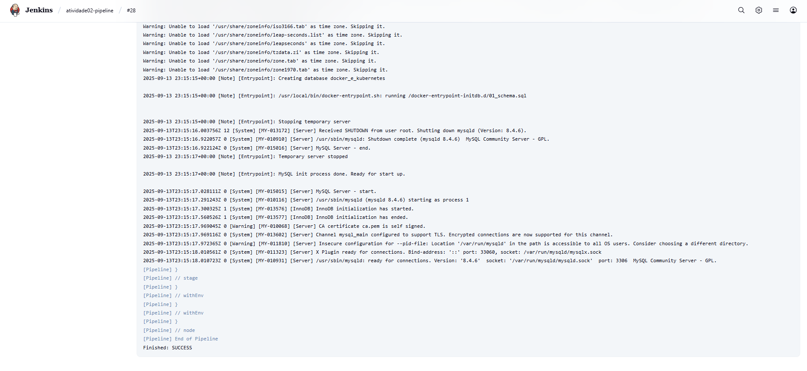
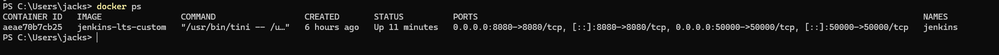
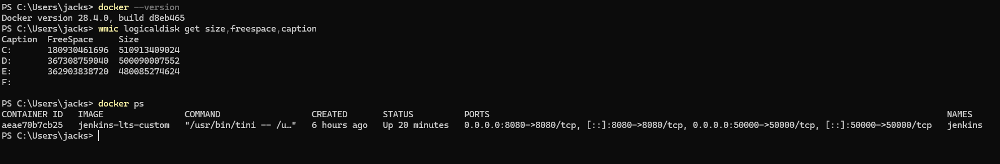

# Relatório – Integração e Entrega Contínuas (CI/CD)
**Aluno:** Jacson da Silva  
**Disciplina:** DevOps / CI-CD  
**Repositório:** https://github.com/jaczsilva/atividade02

---

## 1. Integração Contínua (CI)

### 1.1. Jenkins instalado e desbloqueado
Evidência:  

Jenkins Desbloqueado:

### 1.2. Plugins instalados (Git, Pipeline, Docker)
Evidência:  

### 1.3. Pipeline integrado ao GitHub (Pipeline script from SCM)
Configuração:
- Definition: *Pipeline script from SCM*
- SCM: *Git*
- Repository URL: `https://github.com/jaczsilva/atividade02.git`
- Script Path: `Jenkinsfile`
- 
Configuração Pipeline:

### 1.4. Estrutura do repositório
Pastas-chave:
- `web/` – app Flask (`main.py`, `requirements.txt`, `Dockerfile.web`)
- `db/` – inicialização MySQL (`codigo.sql`, `Dockerfile.mysql`)
- `docs/` – relatório e imagens
- `Jenkinsfile` – pipeline declarativa

Evidências:  
  

[Histórico de Commits](https://github.com/jaczsilva/atividade02/commits/main)
---

## 2. Entrega Contínua (CD)

### 2.1. Build das imagens Docker (Construção)
A pipeline executa:
- `docker build -t atividade02-db:latest -f db/Dockerfile.mysql db`
- `docker build -t atividade02-web:latest -f web/Dockerfile.web web`

Evidência (Console Output Jenkins):  
Após a execução do pipeline, o Console Output registrou todas as etapas do processo. O trecho final do log comprova que o código foi executado com sucesso, encerrando a build com status SUCCESS.

### 2.2. Subida dos containers (Entrega)Evidência – Subida dos Containers (Entrega):
A partir da configuração definida no Dockerfile, docker-compose.yml e Jenkinsfile, os containers foram construídos e executados com sucesso pelo Jenkins.
O Console Output da pipeline registra a criação e inicialização, finalizando com status SUCCESS.
Adicionalmente, a execução do comando 'docker ps' confirma a presença dos containers ativos, conforme mostrado abaixo:

Evidência (Console Output Jenkins):  

### 2.3. Verificações no host
Para garantir a execução adequada do container, foram realizadas verificações no ambiente host.
O comando 'docker --version' confirmou a instalação correta do Docker.
O status do serviço Docker indicou que o daemon encontrava-se em execução.

O comando 'wmic logicaldisk get size,freespace,caption' demonstrou disponibilidade suficiente de espaço em disco.

O comando 'docker ps' evidenciou o container jenkins-lts-custom em execução.

Perguntas:
1. Como a automação dos processos de integração, entrega e implantação contínuas auxiliam o desenvolvimento de software no longo prazo?
A automação ajuda porque diminui erros manuais, deixa as entregas mais rápidas e padronizadas e facilita encontrar problemas cedo. No longo prazo, isso dá mais confiança no código e melhora a produtividade da equipe.

2. Como poderíamos realizar telemetria do nosso pipeline?
A telemetria pode ser feita coletando dados das execuções, como tempo de build, falhas e uso de recursos. Isso pode ser monitorado em ferramentas de logs, dashboards ou até integrado ao Jenkins para acompanhar a saúde do pipeline.
