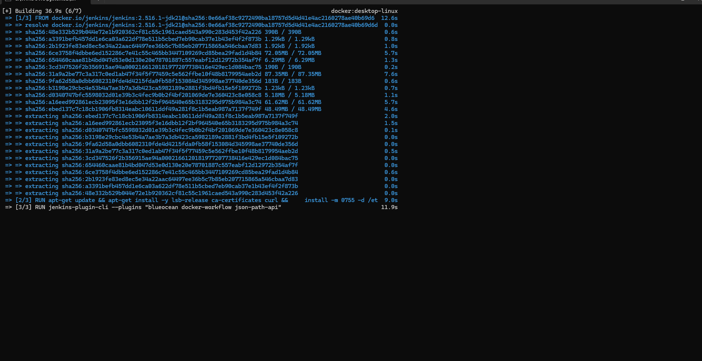
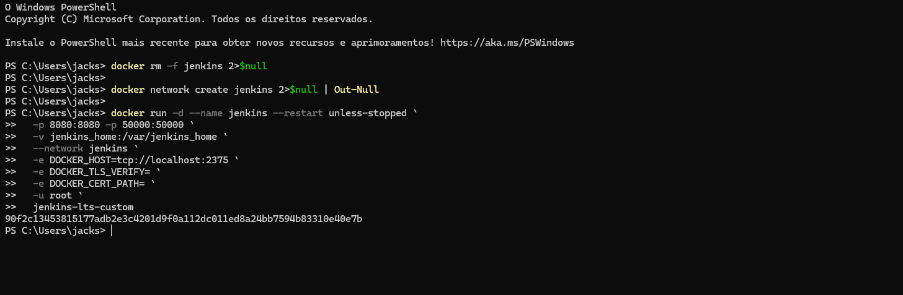
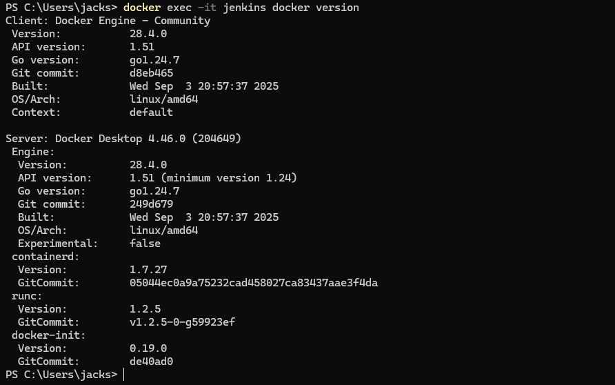
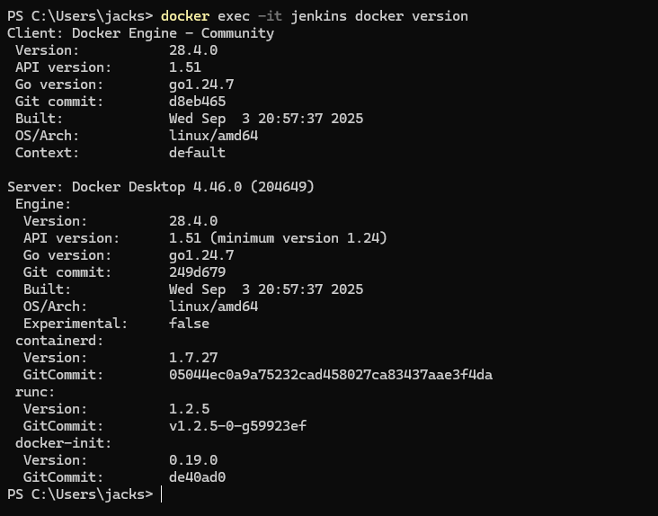
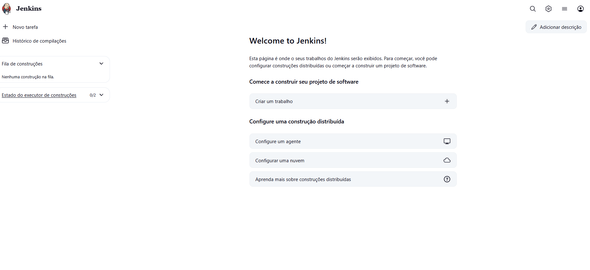
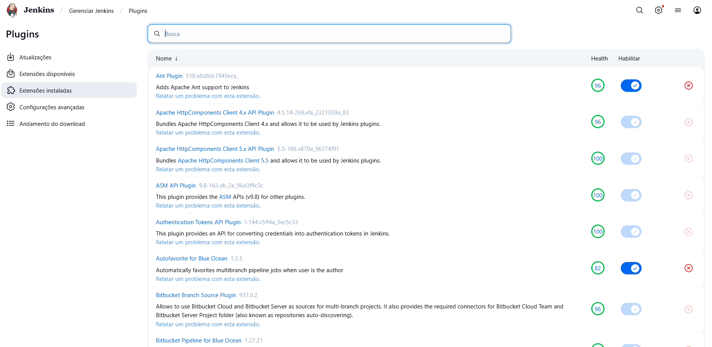
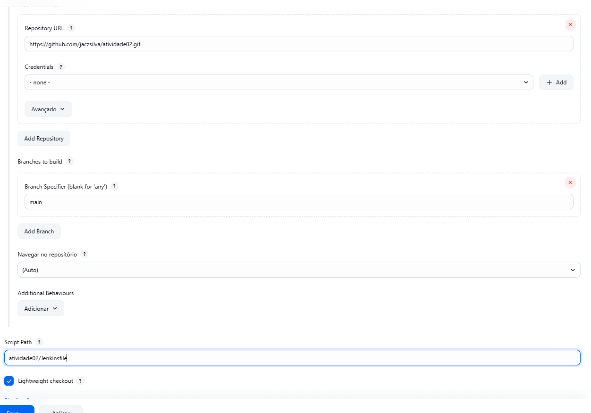

# Relatório – Integração e Entrega Contínuas (CI/CD)
**Aluno:** Jacson da Silva  
**Disciplina:** DevOps / CI-CD  
**Repositório:** https://github.com/jaczsilva/atividade02

---

## 1. Integração Contínua (CI)

### 1.1. Jenkins instalado e desbloqueado
Evidência:  





Jenkins Desbloqueado:


### 1.2. Plugins instalados (Git, Pipeline, Docker)
Evidência:  


### 1.3. Pipeline integrado ao GitHub (Pipeline script from SCM)
Configuração:
- Definition: *Pipeline script from SCM*
- SCM: *Git*
- Repository URL: `https://github.com/jaczsilva/atividade02.git`
- Script Path: `Jenkinsfile`
- 
Configuração Pipeline:



### 1.4. Estrutura do repositório
Pastas-chave:
- `web/` – app Flask (`main.py`, `requirements.txt`, `Dockerfile.web`)
- `db/` – inicialização MySQL (`codigo.sql`, `Dockerfile.mysql`)
- `docs/` – relatório e imagens
- `Jenkinsfile` – pipeline declarativa

Evidências:  
  


---

## 2. Entrega Contínua (CD)

### 2.1. Build das imagens Docker (Construção)
A pipeline executa:
- `docker build -t atividade02-db:latest -f db/Dockerfile.mysql db`
- `docker build -t atividade02-web:latest -f web/Dockerfile.web web`

Evidência (Console Output Jenkins):  


### 2.2. Subida dos containers (Entrega)
Passos:
1. Sobe o MySQL com `MYSQL_DATABASE=docker_e_kubernetes`
2. Aguarda o DB responder (`mysqladmin ping` / `sleep`)
3. Descobre IP do DB e sobe a web com variáveis `DB_*` / `MYSQL_*`
4. Expõe a porta `5000:5000`

Evidência (Console Output Jenkins):  


### 2.3. Verificações no host
Comandos executados:
```bash
docker ps -a
docker logs --tail 30 atividade02_web_app
docker inspect -f "{{json .NetworkSettings.Ports}}" atividade02_web_app
